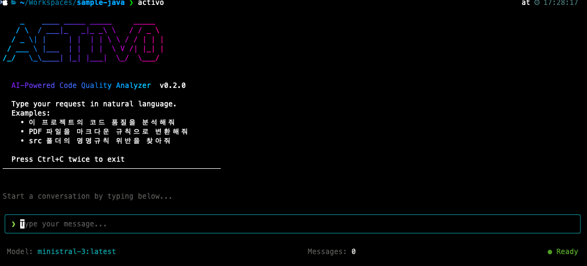

# ACTIVO

AI 기반 코드 품질 분석 CLI 도구 (Ollama 전용)



## 설치

```bash
# 글로벌 설치 (권장)
npm install -g activo

# 또는 npx로 바로 실행
npx activo
```

## 사용법

```bash
# 대화형 모드
activo

# 프롬프트와 함께 실행
activo "src 폴더 구조 보여줘"

# 비대화형 모드
activo --print "package.json 분석해줘"

# 특정 모델 사용
activo --model qwen2.5:7b
```

## 주요 기능

### 기본 도구
- **파일 작업**: 읽기, 쓰기, 디렉토리 목록
- **검색**: grep (패턴), glob (파일명)
- **명령 실행**: 셸 명령 (안전 필터 적용)

### 코드 분석
- **AST 분석**: 함수, 클래스, 타입 구조 파악 (TypeScript Compiler API)
- **복잡도 분석**: 순환 복잡도 계산 및 리포트
- **호출 그래프**: 함수 간 호출 관계 추적
- **심볼 사용처**: 특정 심볼이 어디서 사용되는지 검색

### 파일 요약 캐싱
- **LLM 요약**: 파일 내용을 LLM으로 요약 후 캐싱
- **아웃라인**: 함수/클래스 시그니처 빠른 추출 (LLM 없음)
- **변경 감지**: 파일 해시로 변경 시에만 재생성

### 의미 기반 검색 (RAG)
- **코드베이스 인덱싱**: 벡터 임베딩 생성 (`nomic-embed-text`)
- **의미 검색**: "로그인 관련 코드" → 관련 코드 찾기
- **유사 코드 찾기**: 코드 패턴 검색

### 프로젝트 메모리
- **컨텍스트 저장**: 프로젝트 정보, 기술 스택, 컨벤션
- **노트/사실**: 중요 정보 기억
- **대화 요약**: 세션 간 컨텍스트 유지

### 프론트엔드 분석
- **React**: 컴포넌트 구조, Hooks 사용, 클래스 컴포넌트 감지
- **Vue**: Options/Composition/Script Setup API 분석
- **jQuery**: deprecated 메서드 검출 (bind, live, size 등)

### SQL/데이터베이스 분석
- **SQL**: Java 내 @Query, JDBC 쿼리 분석 (SELECT *, N+1 패턴)
- **MyBatis**: XML 매퍼 분석, ${} 인젝션 위험, 동적 SQL

### 웹 표준 분석
- **CSS/SCSS/LESS**: !important, 중첩 깊이, vendor prefix
- **HTML/JSP**: 접근성(a11y), SEO, 시맨틱 태그, deprecated 태그

### 의존성/API/Python
- **의존성 검사**: package.json, pom.xml 취약점, deprecated 패키지
- **OpenAPI 분석**: Swagger 스펙 검증, 엔드포인트 문서화 품질
- **Python 분석**: Django/Flask/FastAPI 패턴, PEP8, 보안 이슈

### 개발 표준
- **PDF 변환**: 개발표준 PDF → Markdown 변환
- **코드 품질 분석**: 규칙 기반 코드 점검

## 도구 목록

| 카테고리 | 도구 | 설명 |
|----------|------|------|
| **기본** | `read_file` | 파일 읽기 |
| | `write_file` | 파일 쓰기 |
| | `list_directory` | 디렉토리 목록 |
| | `grep_search` | 패턴 검색 |
| | `glob_search` | 파일명 검색 |
| | `run_command` | 셸 명령 실행 |
| **캐시** | `summarize_file` | 파일 요약 (LLM + 캐싱) |
| | `get_file_outline` | 구조 추출 (빠름) |
| | `batch_summarize` | 다중 파일 요약 |
| **AST (TS/JS)** | `ast_analyze` | 심층 코드 분석 |
| | `get_call_graph` | 호출 그래프 |
| | `find_symbol_usage` | 심볼 사용처 |
| | `complexity_report` | 복잡도 리포트 |
| **Java** | `java_analyze` | Java AST 분석 |
| | `java_complexity` | Java 복잡도 리포트 |
| | `spring_check` | Spring 패턴 검사 |
| **Frontend** | `react_check` | React 컴포넌트/Hooks 분석 |
| | `vue_check` | Vue 컴포넌트 분석 |
| | `jquery_check` | jQuery deprecated 메서드 검사 |
| **SQL/DB** | `sql_check` | Java 내 SQL 쿼리 분석 |
| | `mybatis_check` | MyBatis XML 매퍼 분석 |
| **Web** | `css_check` | CSS/SCSS/LESS 분석 |
| | `html_check` | HTML/JSP 접근성/SEO 분석 |
| **의존성** | `dependency_check` | package.json, pom.xml 취약점 검사 |
| **API** | `openapi_check` | OpenAPI/Swagger 스펙 분석 |
| **Python** | `python_check` | Python/Django/Flask 분석 |
| **RAG** | `index_codebase` | 벡터 인덱싱 |
| | `semantic_search` | 의미 검색 |
| | `find_similar_code` | 유사 코드 찾기 |
| **메모리** | `init_project_memory` | 프로젝트 컨텍스트 |
| | `add_note` | 노트 저장 |
| | `get_project_context` | 컨텍스트 조회 |
| | `search_memory` | 메모리 검색 |

## 요구사항

- Node.js 18+
- [Ollama](https://ollama.ai) 실행 중

## Ollama 설정

### 1. Ollama 설치

```bash
# macOS
brew install ollama

# Windows
# https://ollama.ai 에서 다운로드

# Linux
curl -fsSL https://ollama.ai/install.sh | sh
```

### 2. 모델 다운로드

```bash
# 권장 모델
ollama pull mistral:latest

# 한국어 지원 모델
ollama pull qwen2.5:7b

# 코드 특화 모델
ollama pull codellama:7b

# 임베딩 모델 (의미 검색용)
ollama pull nomic-embed-text
```

### 3. Ollama 실행

```bash
ollama serve
```

### 4. activo 설정

`~/.activo/config.json`:
```json
{
  "ollama": {
    "baseUrl": "http://localhost:11434",
    "model": "mistral:latest"
  }
}
```

또는 CLI 옵션으로 모델 지정:
```bash
activo --model qwen2.5:7b
```

## 단축키

| 키 | 동작 |
|---|------|
| `Enter` | 메시지 전송 |
| `ESC` | 진행 중 작업 취소 |
| `Ctrl+C` x2 | 종료 |

## 라이선스

MIT
